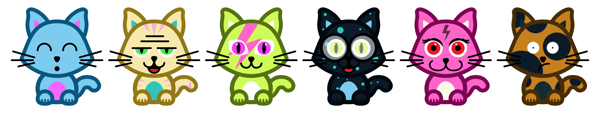
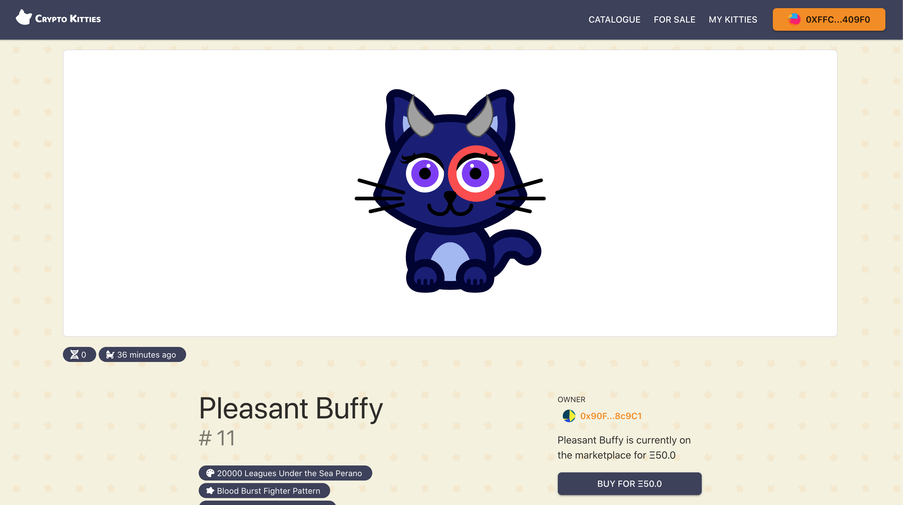
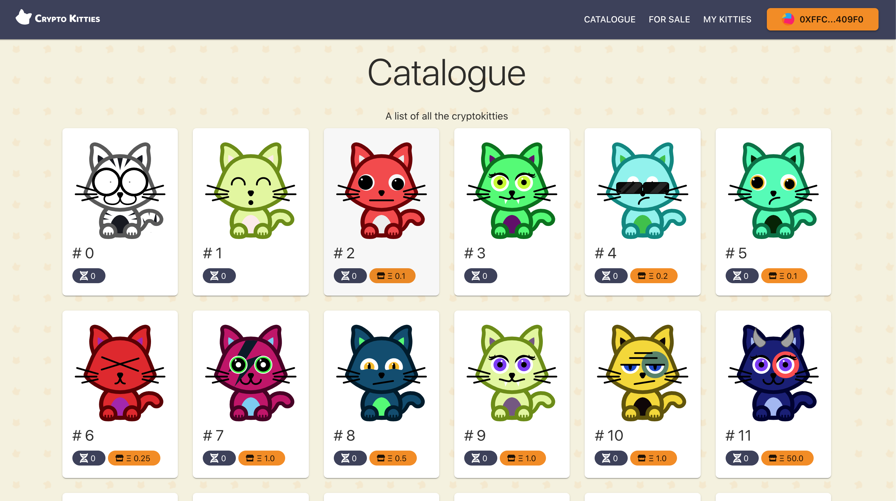

[](https://app.netlify.com/sites/crypto-kitties/deploys)

Website: [https://crypto-kitties.netlify.app](https://crypto-kitties.netlify.app)

# CryptoKitties

CryptoKitties is a ERC721 token, where you can buy, sell and breed your own kitties.

Part of Ivan on Tech [Ivan on Tech Academy](https://academy.ivanontech.com/) bootcamp.

## Table of Contents

- [Ethereum](#ethereum)
  - [Smart contract structure](#smart-contract-structure)
  - [ERC721](#erc721)
  - [ERC 165](#erc-165)
  - [Gen0](#gen0)
  - [DNA](#dna)
  - [Randomness](#randomness)
  - [Instalation](#instalation)
  - [Deploy locally](#deploy-locally)
  - [Deploy to test network](#deploy-to-test-network)
- [Client](#client)
  - [Instalation](#instalation-1)
    - [Local development](#local-development)
  - [Deploy client](#deploy-client)
- [Images](#images)

## Ethereum

Contracts are written in Solidity

- Bootstrapped using [truffle](https://www.trufflesuite.com/)
- [ERC721](http://erc721.org/) compatible

### Smart contract structure

- KittyCore forms the basic of all kitty interactions. It is split into mutliple contracts, inheriting from eachother to make life more easy.
  - **KittyCore** is build in the following way
    - **KittyBase**: All core logic and variables
    - **KittyOwnership** (inherits from KittyBase): All logic to make it ERC721 KittyBase
    - **KittyBreeding** (inherits from KittyBreeding): All logic to breed kitties
    - **KittyMinting** (inherits from KittyBreeding): All logic to make new gen0 kitties
    - **KittyCore** (inherits from KittyMinting): Final contract that is used to interact with everything
  - **MarketPlace** is not inheriting from KittyCore and is a standalone contract. It requires the address of KittyCore to interact with.

### ERC721

The following standard allows for the implementation of a standard API for NFTs within smart contracts. This standard provides basic functionality to track and transfer NFTs.

A standard interface allows wallet/broker/auction applications to work with any NFT on Ethereum. We provide for simple ERC-721 smart contracts as well as contracts that track an arbitrarily large number of NFTs. Additional applications are discussed below.

- [EIP](https://eips.ethereum.org/EIPS/eip-721)
- [Help](https://docs.openzeppelin.com/contracts/2.x/api/token/erc721)

### ERC 165

ERC165’s solution is to define a standard for contracts to publish what interfaces they support, so that other contracts can follow the same standard to detect whether it supports certain interfaces, and only call the interface’s function if the interface is supported.

- [EIP](https://github.com/ethereum/EIPs/blob/master/EIPS/eip-165.md)
- [Help](https://medium.com/coinmonks/ethereum-standard-erc165-explained-63b54ca0d273)

### Gen0

There is a limited amount of gen0 kitties available, defined by `CREATION_LIMIT_GEN0`. Only the owner can mint new kitties (using `createGen0Kitty`)

### DNA

Every kitty has unique DNA, comprised of a 16 digits. When breeding 2 kitties, the child will have a mixture between the dna of its mom and its dad. It also has a chance to mutate a gene randomly

### Randomness

Randomness is simulated through using the timestamp of the mined block.

### Instalation

- Have node installed (v10 or later)
- Have yarn installed `npm install -g yarn` (or npm)
- Have truffle installed `npm install -g truffle`
- Have [ganache-cli](https://github.com/trufflesuite/ganache-cli#readme) or [ganache](https://www.trufflesuite.com/ganache) installed
- Install dependencies
  ```bash
  cd smart-contracts
  yarn install
  ```

### Deploy locally

- Start up local blockchain (ganache or ganache-cli) \
  TIP: When using ganache-cli, use `ganache-cli -d` or `ganache-cli --mnemonic 'myth like bonus scare over problem client lizard pioneer submit female collect'` to always get the same account addresses.
- Run `truffle deploy`
  The contracts should deploy on your locak blockchain

NOTE: make sure to copy `build/KittyCore` and `build/MarketPlace` to `/client/src/assets/contracts`

### Deploy to test network

- Make a file to store the mnemonic secret in `touch .secret` and add your secret.
- Update the `INFURA_PUBLIC_KEY` in truffle-config
- Run `truffle deploy --network ropsten`

NOTE: make sure to have Ether in your first account

NOTE: make sure to copy `build/KittyCore` and `build/MarketPlace` to `/client/src/assets/contracts`

## Client

Client is made with React

- bootstrapped with [Create React App](https://github.com/facebook/create-react-app).
- @web3-react in combination with ethers.js (ethersproject) to handle smart contract interactions.
- Uses [Material UI](https://material-ui.com/) from UI components

### Instalation

- Have node and yarn installed
- Have a way to run a blockchain locally
- Have MetaMask installed
- Install dependencies
  ```bash
  cd smart-contracts
  yarn install
  ```

#### Local development

1. `cd client`
2. Make sure that a local blockhain is running ( via ganache).
3. Update the contract JSONs in `src/assets/contracts`
4. Have all node_modules installed
5. Start local development

```bash
yarn start
```

### Deploy client

Have `netlify-cli` installed

```bash
npm install netlify-cli -g
```

## Images



